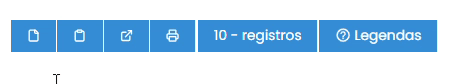
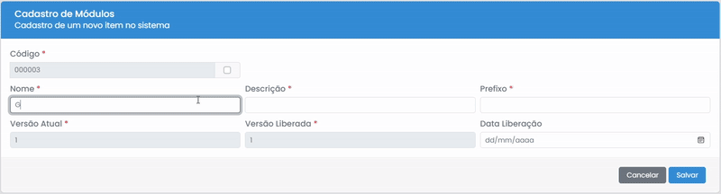
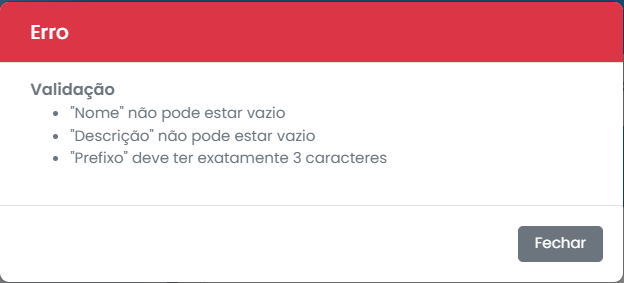

# Criação

Para acessar o formulário de criação, é necessário clicar no ícone de arquivo no topo da tela de listas.
  

## Formulário

Para criar um item, é necessário preencher todos os campos com um asterisco `*` vermelho ao lado do nome, e então clicar em "Salvar".
  

## Erros

Se ouver algum erro no preenchimento dos campos, um modal de erro será exibido indicando os problemas.
  

