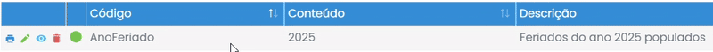
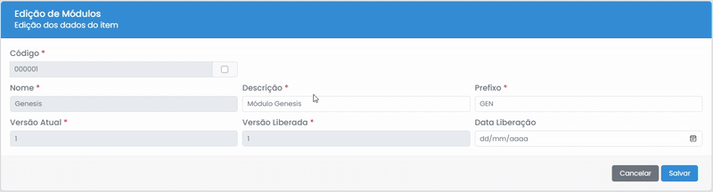
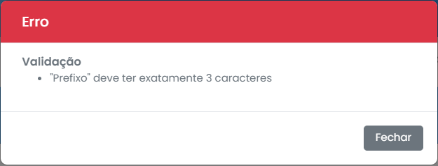

# Edição

Para acessar o formulário de edição, é necessário clicar no ícone de lápis na linha do item desejado.
  

## Formulário

Para editar um item, é necessário que todos os campos não desabilitados e com um asterisco `*` vermelho ao lado do nome estejam preenchidos, e então clicar em "Salvar".
  

## Erros

Se ouver algum erro no preenchimento dos campos, um modal de erro será exibido indicando os problemas.
  

