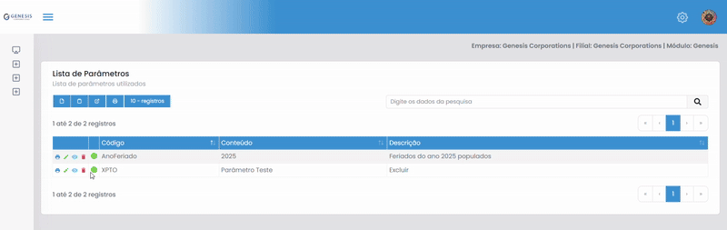
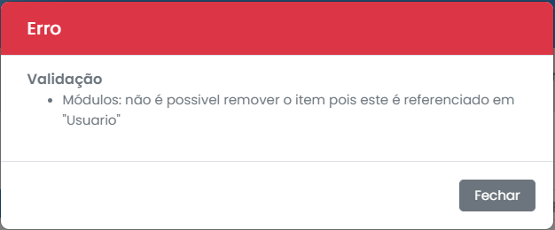

# Remoção

Para remover um item, é necessário clicar no ícone de lixeira na linha do item desejado, e confirmar a remoção no modal que aparece em seguida
  

## Erros

Se ouver algum erro na remoção — geralmente relacionado a dependências —, um modal de erro será exibido indicando o problema.
  

